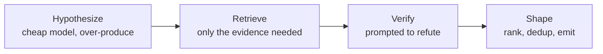

I thought building a coding agent meant writing a very good prompt and wiring it to a model. Then I built [Aster](https://github.com/zfinix/aster), and the repo now has fifteen crates. One of them talks to the model. The other fourteen exist to control what the model sees and to check what it says.

That ratio is the honest summary of everything I learned. Every lesson below reduces to the same move: give the model less, and make it prove more.

## An agent that sounds right is not one that is right

The first version of review did the obvious thing: hand the model a diff, ask for bugs. The findings read beautifully. Confident, specific, plausible. A good chunk of them were wrong, and a wrong finding costs more than no finding, because the third false alarm is the last one anyone reads.

The fix was to stop treating the model's first answer as the output. Review now runs in stages. A cheap model over-produces candidate bugs on purpose. Then a second call, prompted to refute rather than agree, tries to kill each one, and a candidate that cannot survive the attack is dropped. The expensive tokens are spent on disproving, never on the first draft.

The rule that made this work is small: every candidate must state a concrete failure scenario at birth, the specific input or state that makes the code misbehave. A "bug" that cannot name one is either unactionable or made up, and it gets discarded before it costs a single verification token. The scenario also gives the refuter something specific to attack, which matters, because "is this right?" gets a shrug and "does this exact input break this?" gets an answer.

One honest caveat: the survivors carry a confidence number, and it is the verifier reporting on itself, not a calibrated probability. It is useful for ranking findings and useless as odds. Aster says so in its own README, because pretending otherwise is how trust dies.

## More context makes it worse

My instinct early on was generosity. The model is reviewing this function, so give it the whole file. Maybe the callers too. Maybe the tests. Every addition felt like diligence, and past a small threshold every addition made the output worse. The model does not read context the way you hope. Everything in the window competes for its attention, and forty irrelevant files do not make it thorough, they make it noisy.

So Aster retrieves instead of stuffing. A local SQLite index, built with tree-sitter, knows where every symbol lives. When the verifier examines a candidate bug, it gets the changed hunk, a window of source, the enclosing symbol, and its references. The whole bundle is capped in bytes. The model sees a working set, not a repository.

The same rule ended up everywhere once I noticed it. MCP servers can expose dozens of tools, and injecting every schema burns the window before work starts, so Aster shows a schema-free list of names and loads a full schema only when the model asks for that one tool. Skills work the same way: the agent reads titles, and the body loads only when relevant. One idea, applied three times.

## "OpenAI-compatible" is a promise nobody keeps

Aster works with any provider that speaks the OpenAI chat API: OpenRouter, Groq, Anthropic, a model on your own machine. On paper that is one integration. In practice every provider bends the spec somewhere, and the bends are where the agent breaks.

The worst one: some models do not return tool calls as structured fields at all. They write them into the reply as literal text, a JSON blob or an XML-style invoke block, and a loop waiting for a structured call just stalls forever. Aster now has a 198-line module whose whole job is recognizing tool calls disguised as prose, parsing them back into real ones, and executing them so the turn keeps moving. Nothing about that is intelligent. It is cleanup work, and without it "works with any model" would be marketing.

The lesson generalizes: if you claim model independence, you inherit every provider's quirks as your bugs. The claim is still worth making, because owning your own key and model is the point of the project. But it is an engineering budget, not a config option.

## Determinism is a feature you can just take

Models are probabilistic, and everyone treats that as weather. But most providers accept a sampling seed, so Aster pins it to 0 by default and caps output tokens. You can turn both off, but you have to choose to.

This sounds like a small thing until you debug an agent. When a review misfires, I can run it again and get substantially the same misfire, which turns "it sometimes hallucinates" into a bug report with steps to reproduce. The same seed also makes the pipeline testable: change a prompt, diff the findings, and the diff mostly reflects your change rather than the dice. You cannot make the model deterministic, but you can stop adding randomness of your own, and it is free.

## Trust is a setting, not a vibe

An agent that edits your files needs an answer to "how much do you let it do?", and the answer cannot be a feeling. In Aster it is one visible setting with four positions, from `plan`, which never edits, to `edit`, which edits freely. You step through them with a single keystroke mid-chat.

But the setting only covers edits. Commands are the sharper edge, because a model that can run `curl` can exfiltrate anything it can read. So whatever the mode, commands run in a sandbox: writes confined to the repo and temp directories, secrets stripped from the environment, and reads of key files blocked. There is an off switch, because sometimes you need one. It asks for confirmation three times, and then it turns the chat red. Danger you can see is danger you can reason about.

Aster also taught me how easy it is to get this wrong quietly. For a while, answering "always" to a single edit approval promoted the entire session to free-edit mode. One keystroke, meant as "yes, and stop asking about this file", silently granted everything. Nobody designed that, it just fell out of reusing a mode enum for an approval answer. Permission bugs rarely look like bugs. They look like convenience.

## The best ideas were already old

I kept reaching for clever new designs and kept landing on things computer science settled decades ago. Sessions are event-sourced: an append-only log is the truth, and everything else is a view you can rebuild. Tool permissions are capability attenuation, an idea from operating systems. Where someone had actually measured a design choice, I followed the measurement, like the finding that [one level of progressive disclosure is enough](https://arxiv.org/abs/2607.17598) and a second routing layer can break accuracy outright.

The temptation in a field this new is to assume every problem is new. Most are not. The model is new. The engineering around it is persistence, permissions, and retrieval, and those have decades of prior art that mostly transfers.

## Write down what is broken

Aster's harness doc has a section called "Where the harness is shaky today." It says memory is global across repos with no size limit, so it can only rot. It says two finished crates are wired to nothing. It names the exact line where a session flag gets silently ignored.

Writing that list was uncomfortable and turned out to be the cheapest engineering I did all month. Vague unease about the memory system became one sentence with an obvious fix, and the fix became a phase on the roadmap. An agent gets better at exactly the rate you are willing to be specific about how it fails, and the same holds for the person building it.

## The model is the part you rent

Here is the frame all of this settles into. The model is the one component I cannot change and do not control. It improves on someone else's schedule, and it is wrong in ways I cannot patch. Everything reliable about Aster is what got built around that fact: the verifier that refutes, the index that bounds what gets read, the sandbox that bounds what gets run, the log that survives the session.

So that is the lesson, and it fits in a sentence. The model supplies the intelligence, the harness supplies the trust, and trust is built out of exactly two materials: giving the model less, and making it prove more.
