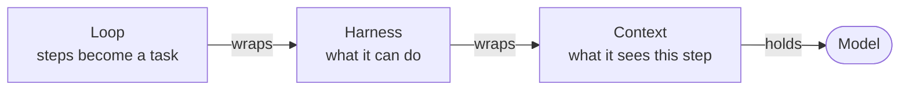
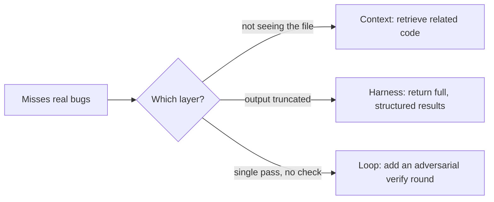

Two teams ship an agent on the same model. One runs untrusted work in production without flinching. The other loops, forgets, and quietly does the wrong thing. The weights are identical, so the difference is everything wrapped around them.

## From prompts to loops

At first the whole game was prompt engineering. Everyone chased the perfect wording, the phrasing that would coax the right answer out of a model. Then it became clear the phrasing was never what carried the task. What mattered was the context inside the prompt: what you put in front of the model, and where. Attention moved to that surface and explored it fast. How do you compact a prompt so it keeps its quality at half the tokens? How do you hand context from one agent to another without dropping pieces on the way? The models fought back. Feed one a long enough window and it holds onto the beginning and the end and quietly loses the middle, a failure mode named ["Lost in the Middle"](https://arxiv.org/abs/2307.03172).

Prompting alone could not fix that, or a dozen failures like it. So harnesses arrived. The labs learned that a model needs a controlled environment and real tools before it can get anything done: sandboxes, tools, MCPs, skills, all of it fed to the model and governed by the harness.

Loops go one step further and sit on top of the harness. Running a task across many steps and trusting it reaches the end is an old problem, and computer science has answered it the same way for decades: a loop. Loop an agent long enough and it can build almost anything. But length is not the whole problem. The agent still has to know where things belong and what counts as done, and it has to be regulated before it can succeed in whatever space you drop it into.

## Three layers, not one

That wrapper is three layers, not one: what the model sees, what it can do, and how its steps become a task. They fail for different reasons and get fixed in different places. Calling all of it "prompt engineering" is why so many agents feel held together with tape. This post separates the three, because the layer a failure lives in is the layer you have to fix it in.



Context is the input to a single step. Harness is the set of actions available and how the world answers. Loop is the control flow that turns one step into a finished task. The model sits in the middle of all three and changes nothing about itself.

## Context: what the model sees this step

The context window is not storage. It is attention. Every token you add competes with every other token for the model's focus, and past a point, more context makes the output worse, not better. A window stuffed with forty files the model does not need is not thorough. It is noisy.

So context engineering is a budgeting problem. The system prompt, the tool schemas, retrieved docs, memory, the running conversation, and every tool result all pull from the same window, and the job is signal per token, not tokens.

Every technique reduces to getting the right thing in front of the model at the right moment. You retrieve instead of stuffing, pulling the three functions that matter rather than the whole repo. You compact, summarizing the resolved parts of a long run so the window holds conclusions and not transcripts. You isolate work in subagents, letting one read forty files and hand back two hundred tokens so the parent gets the answer without paying for the haystack. And you load tool schemas just in time, because a harness with two hundred tools does not need all two hundred definitions resident on every step.

If a smart human with the same information on screen would get the task right, and the model does not, you usually have a context problem. It is not seeing what it needs to, or it is drowning in what it does not.

## Harness: what the model can do

The harness is the body. It decides which actions exist, how results come back, and what the agent is allowed to touch. A model with a bad harness is a brain with no hands.

Tool design is where most of the leverage sits, and the mistake is almost always the same: tools that return raw dumps instead of conclusions. A search tool that returns five hundred lines of matches has pushed the real work back onto the model and burned the context budget doing it. A search tool that returns the answer has done its job. Return the conclusion, not the pile you found it in.

The environment also has to answer in a way the model can act on. An error that says `exit code 1` teaches nothing. An error that says which file, which line, and what was expected turns a dead end into the next step. Hooks that inject feedback after a tool runs are part of the harness too: they are how the world talks back.

And some things should never be the model's job. Deduplication, filtering, sorting, enforcing a hard budget: these are functions. If a plain function can do it reliably, do not spend a model call and a prayer on it. Push determinism into the harness and save the model for the parts that actually need judgment.

This is also where safety lives. Run untrusted code in a container with no network and a memory cap, and let nothing it touches outlive the request. The model never gets the choice to phone home because the harness never gave it the option. Capability is a design decision, not a hope.

If the model clearly knows what to do but literally cannot do it, or the result comes back in a form it cannot use, that is a harness problem. No prompt fixes a missing tool. I go deeper on this layer in [What is Harness Engineering](/blog/what-is-harness-engineering).

## Loop: how steps become a task

A single model call is one step. A task is many steps with a condition that says when to stop. The loop is that structure, and it is the layer people skip.

The naive version is a `while` loop: call the model, run the tool it asked for, feed the result back, repeat. It works right up until the agent does not know it is done, or spins on the same failing action, or produces something wrong and confidently moves on because nothing ever checked.

The stopping condition is the hard part, and the underrated one. "Keep going until done" is not a condition a model reliably evaluates about its own work. Better loops make the structure carry it:

```rust title="verify-loop.rs" group="verify-loop"
let bugs = find(&diff).await; // Don't trust a single pass, produce then verify.

let mut verified = Vec::new();

for bug in bugs {
    // Each reviewer tries to refute the bug claim
    let votes = join_all(reviewers.iter().map(|r| r.refute(&bug))).await;

    // If at least two reviewers cannot refute, consider it verified
    let not_refuted = votes.iter().filter(|v| !v.refuted).count();
    if not_refuted >= 2 {
        verified.push(bug);
    }
}
```

```ts title="verify-loop.ts" group="verify-loop"
const bugs = await find(diff); // Don't trust a single pass, produce then verify.

const verified = [];

for (const bug of bugs) {
  // Each reviewer tries to refute the bug claim
  const votes = await Promise.all(
    reviewers.map((reviewer) => reviewer.refute(bug))
  );

  // If at least two reviewers cannot refute, consider it verified
  const notRefutedCount = votes.filter(vote => !vote.refuted).length;
  if (notRefutedCount >= 2) {
    verified.push(bug);
  }
}
```

The shapes worth knowing:

- Verify, do not assume. Generate, then run an independent check whose job is to refute. A finding that survives skeptics is worth more than three that never faced one.
- Loop until dry. For open-ended discovery, keep going until N rounds in a row surface nothing new. A fixed count of tries stops before the tail.
- Fan out and pipeline. Independent work runs in parallel; a barrier only where a stage genuinely needs every prior result at once.
- Bound the loop. Cap it on a budget or a round count so a bad run degrades instead of running forever.

Multi-agent orchestration is just this layer taken seriously: an outer loop running inner loops, each with its own context and harness. If the model gets individual steps right but the task as a whole comes out wrong, the bug is in the loop, not the prompt.

## Same failure, three fixes

Take one symptom: an agent reviewing code keeps missing real bugs. The instinct is to rewrite the prompt. But the fix depends entirely on the layer:



If it never sees the caller of the function it is judging, that is context. If its search tool truncates at fifty lines and the bug is on line sixty, that is harness. If it reads everything correctly but does one pass and never double-checks, that is loop. Three different repairs, and only one of them is the prompt. Guess wrong and you tune the prompt for the tenth time while the truncated tool quietly keeps hiding the bug.

The diagnostic is worth internalizing. Would a capable human get it right with the same thing on screen? Context. Can the agent even take the action, and can it use what comes back? Harness. Do the steps work but the task does not? Loop.

## Where the lines blur

The taxonomy is a lens, not a law. Compaction is context work that only makes sense because of the loop, and a subagent is all three at once: its own context, its own tools, a step in the parent's loop. That is fine. The point of naming the layers was never to file every technique into one box. It is to stop reaching for the prompt every time an agent misbehaves. Most unreliable agents are not running a bad model. They are running a good one that cannot see what it needs, cannot do what it should, or has no structure telling it when it is finished. Fix the layer that is actually broken.

Go back to the two teams. The one that ran untrusted work in production without flinching was not holding a better model. It had fixed the right layer.

P.S. When I stepped away from mobile I was lost for a while. I did not know what I wanted to do next, or what actually pulled at me, and I had no idea any of this could be so exciting. For a while I lumped it all under "prompt engineering" and left it there. Then I started reading, papers like [AI Harness Engineering: A Runtime Substrate for Foundation-Model Software Agents](https://arxiv.org/abs/2605.13357), and the whole thing opened up into a real field. I am still deep in it, still studying, and it has been a wowing experience. It is so much fun, and I am just happy I picked up this path.
