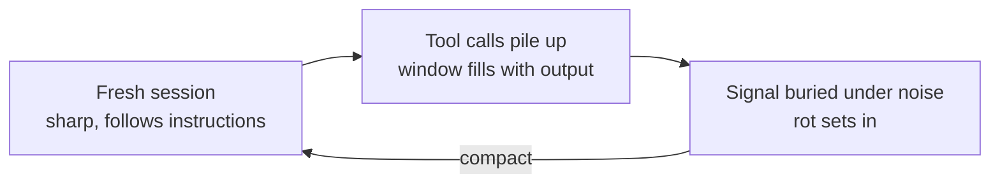
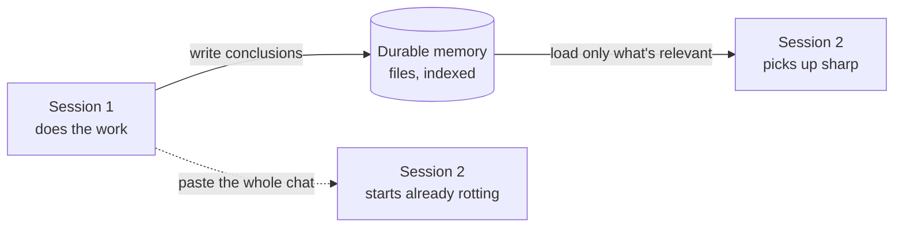

Have you ever wondered why Claude has to auto-compact after some number of messages? Why the thing just stops, folds the conversation in on itself, and keeps going with a shorter version of what you said?

The reason is simple. Models do not have great memory. And the compaction is there to hold off something experts call context rot.

## What context rot actually is

Context rot is the degradation of a model's output quality as a session grows. Early in a chat it is sharp. Twenty tool calls later it is dropping instructions, contradicting itself, and confidently doing the wrong thing. Same model, same weights. The only thing that changed is how much it is now carrying.

Here is where the weight comes from. A single exchange looks small:

> You: Hey Claude, do x and then y.
>
> Claude: thinking, calling a tool, reading the result, thinking again.

That thinking and that tool call are not free. Every one of them lands back in the window as input the model has to keep re-reading on the next step. A file it opened, a test it ran, a stack trace it pulled, all of it stacks up. After a few rounds there is so much input that the important piece, the one instruction you gave at the very start, is now buried under noise the model itself generated.

Models can only hold onto so much before the earliest and most important context starts slipping. Feed a long enough window and it clings to the beginning and the end and quietly loses the middle, a failure mode named ["Lost in the Middle"](https://arxiv.org/abs/2307.03172). An unreliable model is a model that will not follow your instructions, and a model buried in its own transcript is exactly that.

## The window is attention, not storage

The trap is thinking of the context window as a hard drive. It is not. A bigger window is not a place to keep more stuff, it is a wider surface for the model to pay attention to, and attention is the thing that runs out.

Every token in the window competes with every other token for focus. The system prompt competes with your instructions. Your instructions compete with the tool schemas. The tool schemas compete with the last stack trace you pasted. A window with forty files the model does not need is not thorough, it is noisy, and past a point more context makes the output worse rather than better.

So the length of the session is not really the enemy. The enemy is signal per token. A short chat can rot if you dump a giant irrelevant log into it, and a long chat can stay sharp if everything in it is earning its place. Context rot is what happens when the ratio tips: the noise the model generated to do the work starts drowning out the reason it was doing the work at all.

## Compaction is lossy, and that is the point

Compaction is the loop's answer to rot. Summarize the resolved parts of the run so the window holds conclusions instead of transcripts, then keep going. It buys you room. It is also lossy on purpose, and it is worth being honest about that.

When Claude compacts, it is making a bet. It is deciding which parts of the last hour were the point and which parts were scaffolding it can throw away. Most of the time the bet is good. The forty tool calls it took to find a bug are scaffolding, the bug is the point. But sometimes the detail it drops is the one that mattered, and you feel it a few messages later when it re-asks something you already answered.

That is the tradeoff you are always making with these systems. You either keep everything and let the signal rot, or you throw things away and risk throwing away the wrong thing. Good compaction is not about keeping more, it is about keeping the right things: the decisions, the constraints, the current goal, and the state of the work. Everything else is a transcript, and a transcript is not memory.

## The harder problem

Compaction saves a single session from drowning. But sessions end. You close the tab, the context is gone, and tomorrow you start again from nothing. The model that spent an hour learning your codebase remembers none of it. Even a perfect compaction only stretches one conversation. It does nothing for the next one.

So the real question is the one that survives compaction:

> Since we know the limits of these models, how do we move information across sessions with little to no loss?

You do not do it by hoping the window is big enough. Windows are getting bigger, and it does not fix this, because a bigger window still rots, it just rots later. You do it by treating memory as something you build, not something the model has.

## Build the memory the model does not have

The move is to get information out of the transcript and into a durable place before the session ends, then pull it back in cheaply when the next one starts. A few moves carry most of the weight.

**Write conclusions, not transcripts.** When a run resolves something, save the finding, not the forty tool calls it took to get there. "The auth bug was a race in the token refresh, fixed in `session.ts`" is worth more to tomorrow than the entire debugging session that produced it. The next session reads a paragraph instead of replaying an hour, and the paragraph does not rot.

**Externalize memory into files.** Keep each fact in its own small file, indexed, so the next session loads only what is relevant instead of everything you have ever learned. This is the important inversion: the window stops being storage and goes back to being attention. You are not carrying memory in the conversation, you are carrying a pointer to it and pulling the right page in at the right moment.

**Hand off, do not dump.** When one session ends and another begins, pass a tight summary of what is done, what is left, and what was learned. Pasting the old chat into the new one just imports the rot along with it. A clean handoff is a fresh window with only the conclusions loaded, which is exactly the state you want to start from.

Notice what these have in common. None of them ask the model to remember better. They all move the remembering out of the model and into something you control, because the model is the part you cannot change and the memory around it is the part you can.

## Two problems, not one

There were always two problems hiding under the same word. Compaction solves the first: it keeps one conversation honest by throwing away the scaffolding and keeping the point. External memory solves the second: it lets tomorrow's session pick up where today's left off without dragging the rot along. One is for surviving the session. The other is for surviving the gap between them. You need both, and they are not the same tool.

So the next time Claude pauses to compact, you know the move. It is not a wall you are hitting, it is the system admitting what the model cannot do and building around it. Do not ask the model to remember. Give it a place to write things down, and hand it the right page back at the right moment.

## P.S. shameless part

I write about this because it is what I do all day: build the harness around the model, not the model itself. Memory, compaction, retrieval, the boring plumbing that decides whether an agent is trustworthy or just clever.

I am looking for my next role, AI DevRel Engineer or AI Engineering. If your team works on agents, developer tools, or anything where the hard part is making a model reliable across sessions, I want to talk. Reach me at [chiziaruhoma@gmail.com](mailto:chiziaruhoma@gmail.com).
