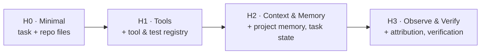

You do not build all of this at once. The paper lays out a ladder, H0 to H3, where each rung adds exactly one class of runtime support. Building it this way is also how you measure it: each level is a controlled ablation that exposes one named kind of help, so you can see what it buys you.

- **H0, minimal**: the task description and the repository files, nothing else.
- **H1, tool harness**: adds a tool registry, a test-command registry, and a protocol for using them.
- **H2, context and memory**: adds project memory, a task-state file, and a context-selection protocol.
- **H3, observe and verify**: adds a deterministic check registry, a bug-reproduction protocol, failure attribution, and a verification protocol.

At H3 the agent stops guessing and starts working like an engineer: **reproduce, attribute, fix, verify, report.** That loop is the difference between an agent that says it fixed the bug and one that can show you.
