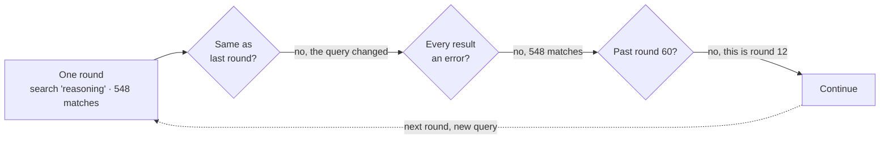
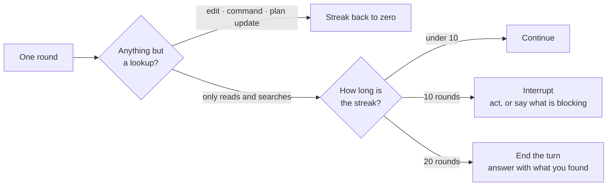

I gave my coding agent a small job. Rename a label in two files. On one model it finished in six rounds and told me what it changed. On another it read and searched for forty rounds and never edited anything. I hit stop twice.

The obvious read is that the second model is worse. That is not what happened. Both models did exactly what my harness allowed. Only one of them needed permission to stop.

## The guards were counting the wrong thing

[Aster](https://github.com/zfinix/aster) had three protections against a runaway loop, and all three watched for repetition.

The first compares each round of tool calls to the last one. Same tools, same arguments, same results, three times over, and it interrupts with a correction. The second throws away lookups that are byte-for-byte identical to one already answered this turn. The third caps the whole turn at sixty rounds.

Now look at what the model actually did. It searched for `reasoning` and got 548 matches. Then `reasoning|thinking`, 126 matches. Then `ReasoningPanel|ReasoningBlock`, 88. Then something narrower, 8.

Not one of those rounds repeated. Every query was different, so every fingerprint was different, and all three guards agreed the turn was making progress. It was making motion. Those are not the same thing.



Every arrow out of those three questions is the honest answer. The loop is not broken. It is asking the wrong question three times.

## Why the prompt did not save it

I had already written the rule. My tool instructions end with "stop gathering as soon as you can act."

The problem is everything around it. Eight bullets before that line tell the model to batch its lookups, to think ahead about what else it will want once it sees the first result, to send searches together instead of one at a time. The description of the batching tool calls it the single biggest thing the model can do to answer faster. Then one clause at the very end says stop.

A strong model weighs that clause correctly, because it already knows when it has enough. A weaker one weighs it by how much text argues for each side. I wrote a prompt that argued nine to one for gathering, and then I blamed the model for gathering.

You cannot prompt a model into stopping. Stopping has to be something the harness can do on its own.

## Measure effect, not repetition

So I changed what gets counted. A round is now marked barren if everything in it was a lookup: a read, a search, a listing. Anything else counts as acting, including an edit, a shell command, or a plan update.

Ten barren rounds in a row and the harness interrupts, naming the streak and telling the model to act on what it has or say plainly what is blocking it. Ten more after that and the turn ends by forcing an answer out of whatever it found. That last part matters. It is not an error, because the model gathered plenty, it just never committed, so you get the findings instead of a failure. A single edit anywhere resets the count, which leaves a genuinely long investigation alone.



The question changed from "have I seen this before" to "did anything happen".

Then I added the piece that was missing entirely. The model never knew a budget existed. Halfway through the turn it now gets told, exactly once, how many rounds it has spent and how many are left.

That is the whole fix. The agent can finally see the clock it was already running against. On the session that started all this, the first interruption would have landed around round ten instead of round forty.

## What this does not fix

Ten is a guess. It is high enough to let a real investigation finish and low enough to catch a wandering one well before the cap, but I have no principled reason to prefer it over eight or twelve. Real sessions will tell me.

The classification is crude too. A sub-agent counts as acting, and a sub-agent can be sent off to do more reading. A model that wants to gather forever can still do it through a proxy. I picked that deliberately, since interrupting a deliberate fan-out is worse than the occasional miss, but it is a hole and I know it is there.

## Do not write the eval runner

Doing the swap by hand works once. I ran that rename myself, watched the scrollback, and hit stop twice. It does not scale to five models and a list of tasks.

To repeat it I needed two pieces. A harness is the code that runs one turn: it sends the prompt to a model, runs the tools the model asks for, and sends the results back. A runner drives that harness over a list of tasks and then checks what the agent actually did.

The harness is mine. The runner is not. Aster's live evals run on [Ori](https://openrouter.ai/labs/ori), OpenRouter's agent harness and eval runner. Ori ships a harness of its own, but `defineHarness` lets a project supply a different one, and the runner drives that instead. Aster's version spawns the real `aster --stream` binary as a subprocess and translates its output into the events Ori expects.

Ori keeps the scheduling, the assertions, the timing, and the JSON report. None of that is about Aster. Every agent project needs it and every agent project has to maintain it. The turn loop is the only part that is actually about Aster, so it is the only part I wrote.

Three things that buys me, and they are the three the manual version could not do:

- The assertions run against the binary I ship, not a stand-in for it.
- The model is a flag. One command runs the same cases on every model in the list.
- The report comes back as JSON, so Rust prints the summary and I stop reading scrollback.

The assertions also talk about behaviour instead of text, which is the only way to catch the failure this post started with:

```ts
run.tool("edit_file").toNotBeCalled();
run.toMention("activation");
run.toComplete();
```

Two honest holes. Ori reports the tool calls as one flat list of names, and it never says which calls shared a round-trip. Rounds are the whole subject of this post, and the live suite cannot see them, so I count those from recorded sessions instead. The second hole is worse. If my harness fails to start, Ori falls back to its own agent, and then every assertion passes green against the wrong program. The summary now refuses to count a pass unless the report names `aster`.

## Swap the model on purpose

None of this was a DeepSeek bug. My harness had been shaped, round after round, by one model that happened to have good instincts about when to stop. Every place I leaned on those instincts instead of writing the rule down was invisible to me, because the model I tested with kept filling the gap in silently.

A different model does not fill the same gaps. That is what makes it such a cheap audit. You do not need an eval suite to start. Point your harness at a model it was never tuned for, watch where it falls over, and every one of those spots is somewhere you were quietly trusting the model to do your job for you.

I think that is the most useful thing a second model gives you, long before it is ever your default.
