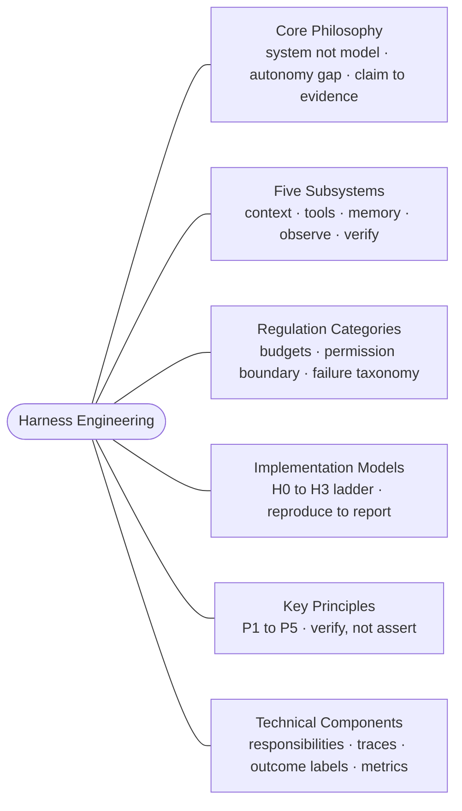

For a long time I thought a better agent just meant a better model, and a lot of people still do. Swap in the smarter one, get better results. That is true right up until it is not, and the place it stops being true finally has a name: the harness.

## How we got here

A few years ago AI went mainstream. Once the thrill of talking to a chatbot and watching it print careful, human-sounding words wore off, the next wave arrived: AI that writes code.

The first coding assistants were barely more than skeletal wrappers around a raw model. Cursor, Bolt, and v0 were my introduction, and they mostly worked by scaffolding a pile of predefined prompts and instructions to steer the model in the right direction.

Then came vibecoding. Agents were, and still are, sold as a god in your pocket: do and undo, create and destroy, all from a few keystrokes or a spoken sentence. They got faster and smarter, but the mistakes kept coming, and every new version promised to fix the last one's. What actually fixed them was not a smarter model. It was the scaffolding built around it, the thing we now call harness engineering.

The hard lesson underneath it is that models are brilliant and completely untrustworthy. They will lie, break things, and walk over system-level instructions to satisfy whatever a user wants in the moment. A nuke in a child's hands is still a nuke. You cannot treat a model like a person and hope it behaves; you enforce rules, you build guardrails, and you hand it the right tools, and only then does it do genuinely great work. That is why we can confidently ship real code today with Claude Code, Codex, and OpenCode: we are trusting their creators to get the harness right.

## Agent = Model + Harness

It looks like a throwaway formula, but it is the whole idea, so it is worth reading slowly.

The **model** is the raw intelligence: the weights that turn a prompt into tokens. It reasons, writes code, and plans. On its own, though, it cannot actually do anything. It has no hands. It cannot open a file, run a test, or remember what it tried five minutes ago. It is the part you buy, and the part you cannot change.

The **harness** is everything else in the system: the tools it can call, the context it sees, the memory it keeps, the checks on its work, and the boundary it is not allowed to cross. It is what gives the model hands to act, eyes to see what happened, and a leash so it cannot wander somewhere it should not.

The **agent** is neither half on its own. It is the two composed, and the plus sign is the part people skip. Capability does not come from a smarter model alone. It comes from a model wired into a harness that lets it act, see the result, and get corrected. **Harness engineering is the practice of designing that second half so a capable model becomes a reliable one.**

## The autonomy gap

Zhong and Zhu put it precisely in [AI Harness Engineering](https://arxiv.org/abs/2605.13357): autonomous capability comes from a model, harness, and environment working as one system, not from the model alone.

> The question stops being "Is the model smart enough?" and becomes "Can the system produce a verifiably correct, attributed, and maintainable change?"

The distance between what a model can do in the small and what it can actually finish on its own is what they call the autonomy gap, and the harness is how you close it.

## The six branches

Read enough about harness engineering and the same shape keeps surfacing. The one-line definition is easy, but underneath it sits a whole discipline, and it decomposes cleanly into six areas that build on each other.

The first is the philosophy that reframes the problem, treating the agent as a system rather than a model. The next three are the anatomy: the subsystems a harness is built from, the runtime resources it has to regulate, and the ladder you climb to build it a rung at a time. The last two are the craft of doing it well: the principles that keep a harness honest, and the concrete components and traces you actually ship. Together they answer one question: how do you turn a brilliant, untrustworthy model into a system you can hand real work?

This post is the map. Each branch is its own part in the series, and here is what each one covers:

1. **[Core Philosophy](/blog/harness-engineering-core-philosophy)**: the one move everything rests on. The agent is a system, not a model, the autonomy gap is what you are closing, and "done" has to be evidence rather than a claim.
2. **[Five Subsystems](/blog/harness-engineering-five-subsystems)**: the five parts every harness needs, context, tools, memory, observability, and verification, and the trace each one leaves so you can see what it did.
3. **[Regulation Categories](/blog/harness-engineering-regulation-categories)**: a harness as control over scarce resources. The budgets and permission boundary it enforces, and the eight-way failure taxonomy you attribute a break to before patching it.
4. **[Implementation Models](/blog/harness-engineering-implementation-models)**: you do not build it all at once. The H0 to H3 ladder adds one class of runtime support at a time, ending in the reproduce, attribute, fix, verify, report loop.
5. **[Key Principles](/blog/harness-engineering-key-principles)**: the five rules, P1 to P5, that hold a harness up, from exposing runtime resources to attributing a failure before recovering from it.
6. **[Technical Components](/blog/harness-engineering-technical-components)**: the concrete responsibilities and the artifacts they emit, bundled into an episode package with an outcome label, which is what makes the whole thing measurable.

## Where this leaves me

The map is large, but the thesis underneath it is small: the model is the part you cannot change, so everything that makes an agent trustworthy is the part you build around it. Six branches, five subsystems, four rungs, and a pile of traces all serve that one idea.

For the simpler version, the three layers of context, harness, and loop and how to tell which one a failure lives in, read the companion piece, [Context, Harness, Loop](/blog/context-harness-loop-engineering).

## Further reading

- Birgitta Böckeler, [Harness engineering for coding agent users](https://martinfowler.com/articles/harness-engineering.html)
- Thoughtworks Technology Podcast, [What is harness engineering?](https://www.thoughtworks.com/insights/podcasts/technology-podcasts/what-harness-engineering)
- Hailin Zhong and Shengxin Zhu, [AI Harness Engineering: A Runtime Substrate for Foundation-Model Software Agents](https://arxiv.org/abs/2605.13357)
